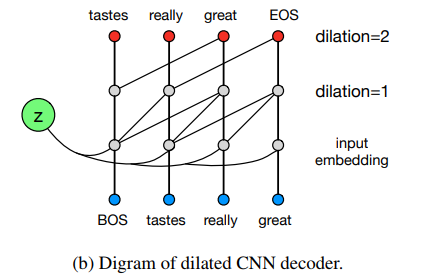
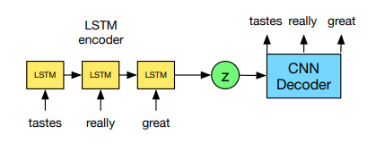

# Model based Method: Training VRAE for Text Generation

这是一篇总结文章，回顾几种基于模型解决VRAE在文本生成问题的方法。

VRAE[1]最初尝试应用VAE于文本生成，它最初采用的是双LSTM结构，如图一，即Encoder和Decoder都采用LSTM。但作者发现，这种模型存在严重的“posterior collapse”问题，即在训练过程中，Decoder容易忽略隐变量的信息。它试验中表现为：1）KL_loss迅速降为0，2）Decoder变为单一的语言模型，只能生成单一的句子。一旦出现这种情况，VRAE就只能学到高斯噪声的隐变量，这对于表达学习是致命的，背离了我们采用VAE来做生成的目的。作者认为这是由于Decoder的建模能力过强的原因（LSTM是万能逼近器），并基于这一点提出两个trick来克服这个问题。“Word Dropout”通过把Decoder的“Ground Truth Inputs”以一定概率随机的填为UNKOWN,这样Decoder就没法从Decoder的“Ground Truth Inputs”得到完全的信息，它若要想完全重构，则必须利用来自隐变量的信息。但在实验中，这种方法的效果并不明显。另一个Trick：KL_annealing, 在KL_loss前面添加一个权重， 在训练的过程中， 通过动态的改变这个权重，来协调平衡VAE目标函数中的重构项和KL项。训练初期，权重设置为0，VRAE退化为普通的AE, 这时只有重构项起作用，Encoder能压缩足够的信息到隐变量中，然后权重慢慢增长到1，VRAE退火为真正的VAE。KL_annealing在实验中表现相对更好，不过总体而言，即使有这两种Trick的加持，这种体系结构仍然很不稳定。

> 

在VRAE[1]的研究基础上，HybirdVAE[2]提出了一种基于模型的改进方法，整体的VRAE的结构不变，但是它的Encoder换用卷积神经网络来实现, Decoder则改用一种卷积神经网络与循环神经网络的混合模型，如图二。这种网络有如下几个优点：1）得益于卷积网络，它更加容易训练；2）更利于GPU并行；同时，它的Decoder在反卷积后面再接了一层LSTM网络，这有效的弥补了卷积神经网络对时序建模能力不足的问题。如果只是这样，并不能有效的解决“posterior collapse”问题，作者在此模型的基础上，引入了一个额外的重构项，新增的重构项能有效的平衡原始VRAE中两项的对抗，起到了稳定训练的作用。在试验中，这种模型很少会失败，不过该模型生成的样本可能会因受到模型结构以及新增重构项的影响而表现出一些细微的差异。

>

VCRE[3]基于跟[1]同样的假设：Decoder的建模能力越强，则对于Encoder的信息的使用率越低，提出了另一种基于模型的改进方法。如同[2]一样，作者采用了对语言建模能力相对较差的卷积神经网络来实现VRAE的Decoder。同时，为了弥补卷积神经网络对于长期依赖建模能力的不足，作者采用了最近提出的空洞卷积网络（Dilated Convolutions），如图三。空洞卷积能在不增加计算量的基础上，扩大感受野，提升对文本中长依赖的建模能里。整个模型的结构如图四。

>
>

总结：目前仍然缺少对于“posterior collapse”问题原因真正的洞见，缺少釜底抽薪的方法。不过上述这些研究工作能部分的解决此问题，同时也加深我们对“posterior collapse”问题的感性认识。

[1] Generating Sentences from a Continuous Space

[2] A Hybrid Convolutional Variational Autoencoder for Text Generation

[3] Improved Variational Autoencoders for Text modeling using Dilated Convolutions