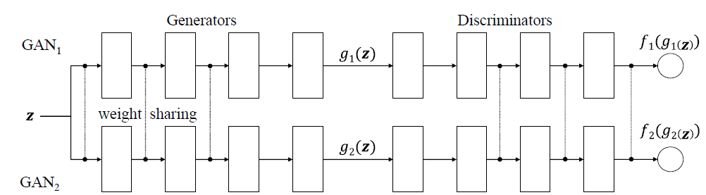
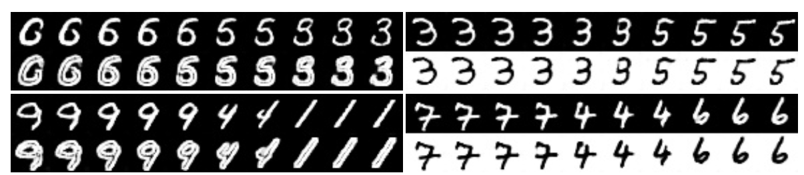
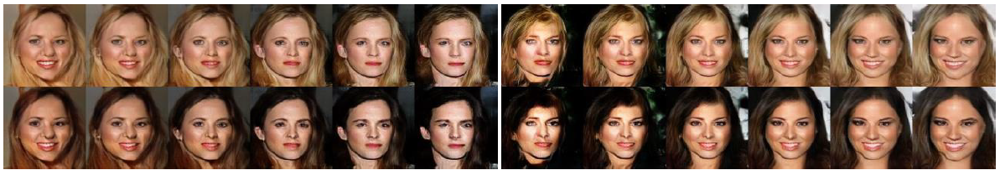

# Notes on Coupled Generative Adversarial Networks

> 论文：Coupled Generative Adversarial Networks
> 
> 作者：Ming-Yu Liu ， Oncel Tuzel

本文提出了一种新颖的GAN模型， 能够学习到两个不同领域，分别用两个随机变量X和Y来表示，它们之间的联合概率分布p(X,Y)。同时模型还提供了采样其边缘分布的能力。该模型可以用于从两堆没有配对的图像中学到成对的数据表示。

## 背景 ##

多领域的数据之间的联合分布为来至不同领域的数据之间的共现建模，一旦我们能学习到这个联合分布，就能比较容易的产生语义相关的成对图像样本，同时也能应用于图像转换，领域迁移。如何学习多领域的数据之间的联合分布就显示了其基础作用。之前的工作是通过监督学习的办法，需要大量的已经配对了的数据集来训练网络。但是构建大量的成对图像数据集所需的成本很高。本文在此基础上，提出了一种无监督的方法来克服这个困难。

## 本文方法：CoGAN ##

**模型的细节：**
> 

如上图所示，CoGAN由两个GAN网络构成，但两个单独的GAN只能学到各领域的边缘分布p(X), p(Y)。CoGAN与两个单独的GAN有以下两点不同：1）这两个GAN共用一个z，通过这种方法，能学到两个不同领域之间的一个对应关系。但这个对应关系是比较松散的，它们缺乏语义的关系。我们一般的需求是相似的图片共现的机会更大一点，不相似的图片共现的机会更小一点，如果只是共用一个z是没法学到这种语义关系的。语义关系可以看着一种高层特征，对应到图一上，靠近z的那几层表示一种高层的特征，而生成器的后几层表达底层特征， 同时判别器的前几层表达低层特征，后几层表达高层特征。为了能让学习的成对的图片有相似的高层特征，作者提出一种权重共享的方式，让两个生成器的前几层与判别器的后几层共享权重，这样在学习的过程中，两个领域中有相似的高层特征的图片会学到对应的z表达。

这种很直观很trick的想法只能通过实验来验证了，下面介绍一下作者的实验结果已经该模型的潜在应用。

## 实验效果 ##
> 
> 

