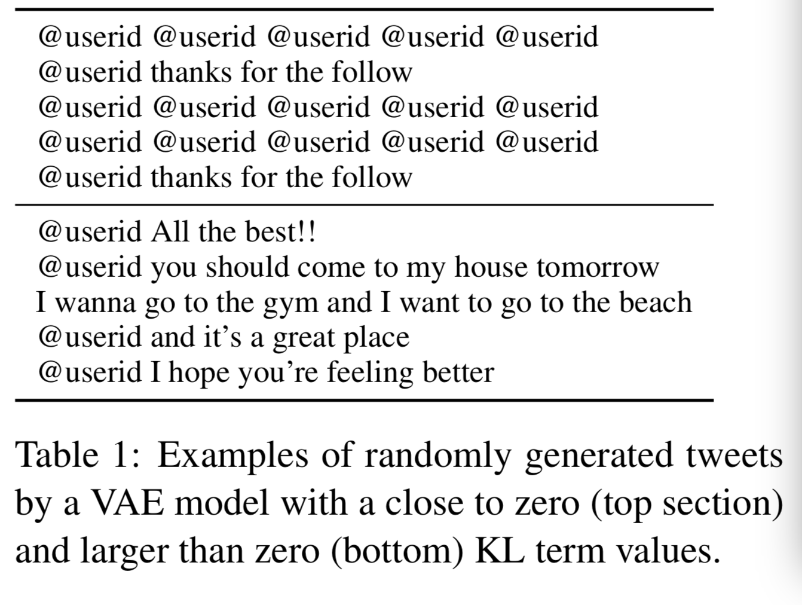
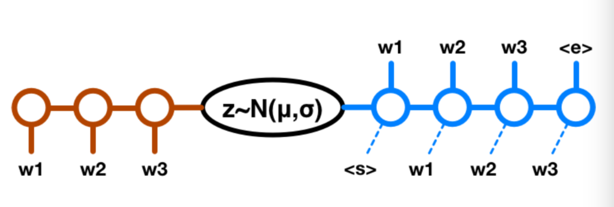
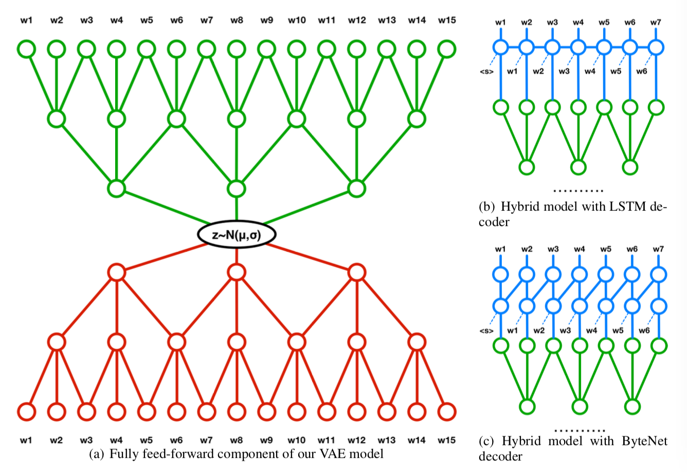
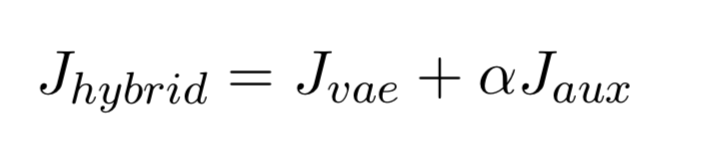

# 论文笔记：A Hybrid Convolutional Variational Autoencoder for Text Generation

应用VAE生成模型于文本序列时，遇到的主要困难是：“KL_loss消失”。即 VAE 目标函数的 kl-loss 项在训练过程中迅速降为零，导致 VAE 模型退化为原始的 AutoEncoder，训得的模型也基本无法应用于生成。实验结果可以参考下图：

以这个问题为出发点，论文作者找到一种网络结构，它能有效的用于 VAE 的学习（对于文本生成任务）。下图是传统的模型：

其中encoder 和 decoder 都使用 lstm。由于 lstm 自身的特点：训练困难；能力强，导致在训练过程中非常容易出现“KL_loss消失”的情况。根据[1]中提出的一些技巧可以部分的解决这些问题。作者在此基础上，提出了一种新的网络结构，它能进一步弥补上述问题。下图是新提出的模型图：

该结构中，encoder 使用一维卷积网络，相比于循环网络，它更方便用于 GPU 运算，而且更加容易优化训练。decoder 使用反卷积和循环网络相结合的混合网络，其中 LSTM 的输入由前一个词与反卷积的输出相拼接组成，这样能保证网络能学到序列之间的依赖，弥补前馈网络在这方面的不足。

在训练过程中，为了解决“KL_loss消失”问题，除了使用[1]中的“kl-cost annealing”,"word dropout"等技巧外，作者提出了在VAE 的损失函数上增加一个正则项来近一步克服这个问题，正则项为：

它是反卷积部分的输出，因为这时候还没有涉及到前一个单词，所以它必须依赖于 z 来生成一个有意义的重构。修改后的损失函数为：

实验结果参考原论文。

### 引用：

[1] Generating Sentences from a Continuous Space