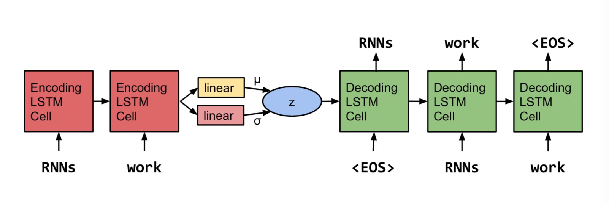
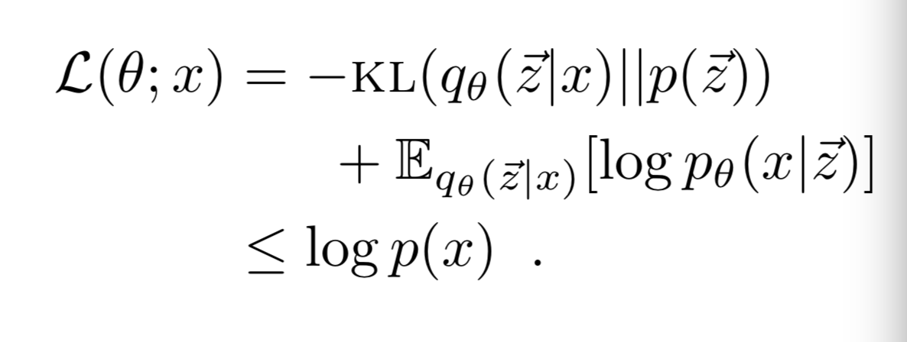
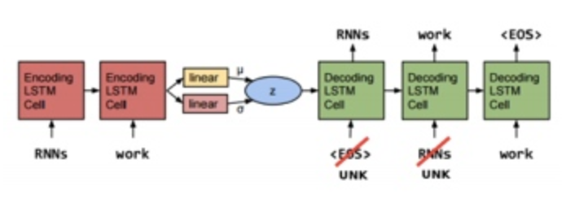

# 论文笔记： Generating Sentences from a Continuous Space

传统的 Seq2Seq 语言模型更类似 AutoEncoder，它学习到的表达比较松散，不能学习到一些全局信息的可解释性表达。VAE 是近年来提出的一种优秀的生成模型，相较于传统 AutoEncoder，他学习到的隐层表达具有很好的流形结构。这篇文章即是作者结合传统的 Seq2Seq 架构和 VAE 训练方式在语言生成方面的探索，期望通过这种结合产生的语言模型能学到语句的一种全局可解释的表达，比如像文章主题等高层语言特性。具体的模型结构如下：

该模型与 Seq2Seq 的区别在于隐变量 z 的表达和学习方式不同了。Seq2Seq的隐变量 z 直接由 Encoder 最后一层隐层的值来表达，通过重构误差来学习。而该模型的隐变量z假设服从期望为 u 方差为 segma 的高斯分布的后验概率 p（z|x）来间接表达的，Encoder 并不是直接学习 z 的，而是通过学习它的期望和方差来间接学习到 z 的。该模型优化的目标函数与 VAE 的目标函数一致：

## 优化挑战以及训练的 Tricks

在 VAE 的应用中常会遇到“posterior collapse”的问题：即如果 Decoder 的能力特别强的时候，隐变量就容易被 Decoder 忽略。根据上面的公式可以看出，要想学到有用的信息，则 KL-cost 这一项要不为 0，同时交叉熵那一项尽可能的小。而在训练的过程中表现为，代价函数中的 KL-cost 这一项非常接近 0。当这一情况出现时，就不能传回传给 Encoder 有效的梯度。

作者提供了两种解决“posterior collapse”问题的办法。

### 方法1：KL-cost annealing

训练的时候，在目标函数的 KL-cost 项前面增加乘上一个权重 u。在训练之初令 u=0，即忽略掉 KL-cost 项，此时模型就退化为原始的 AutoEncoder 了，在此时可以让隐变量 z 学习到尽可能多的信息。随着训练的进行，逐渐增加 u 的值，最后在 u=1的时候停止，这时的目标函数就等于真实的变分下界了。这可以看做是从原始 AutoEncoder逐渐退火为 VAE。

### 方法2：word dropout

出现“posterior collapse”问题的原因是 Decoder 能力很强，自然而然想到的另一种克服“posterior collapse”的办法即是减弱 Decoder 的能力。作者提出在训练的时候随机的把输入词换成“unk”，如上图所示。这样 Decoder 就只能去更多的依赖隐变量 z 来学习了。

实验部分参看原论文。